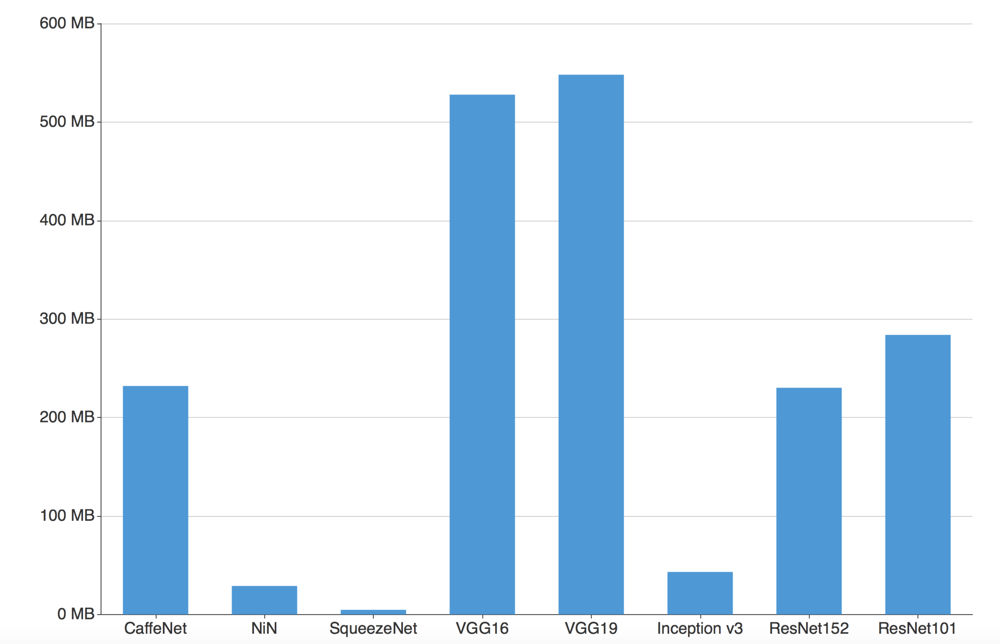
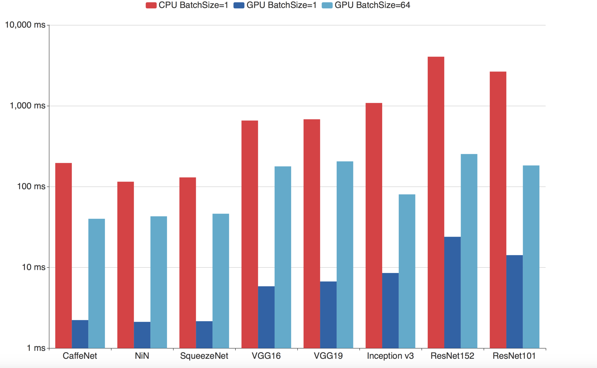
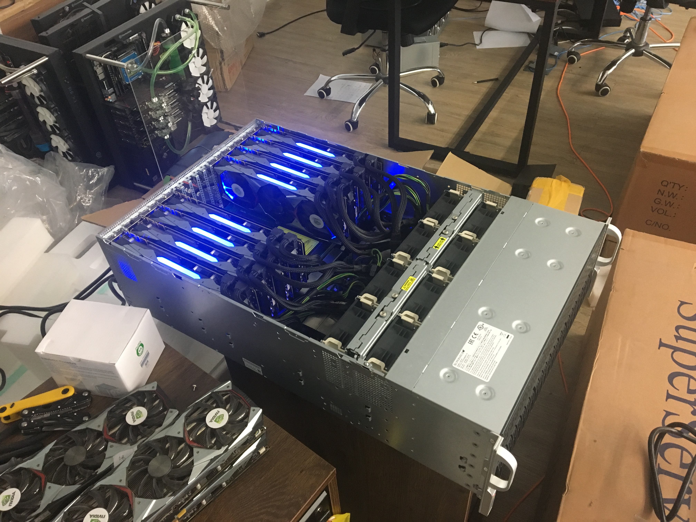

# CortexInferencePerformanceTest
This repo is the source code of some experiments on a single machine for the throughput of inference instructions executed by all nodes.

Experiments were performed on the CPU and GPU to test the inference speed of deep learning models on the platform.

## Environment

### Hardware
* CPU: E5-2683 v3
* GPU: 8x1080Ti
* RAM: 64 GB
* Disk: SSD 60 EVO 250 GB

### Software
* MXNet
* OpenCV 3.1

### Others
* Dataset: ImageNet Dataset (winter 2011 release) [http://image-net.org/imagenet_data/urls/imagenet_winter11_urls.tgz]
* Models [http://mxnet.incubator.apache.org/model_zoo/index.html]:  
  * CaffeNet
  * Network in Network
  * SqueezeNet
  * VGG16
  * VGG19
  * Inception v3 / BatchNorm
  * ResNet-152
  * ResNet101-64x4d

## Usage
* src/InferenceTest.py is single GPU test for inference.
* src/InferenceStreamTest.py is multi-GPU test for image stream data inference.
* src/config.json is parameters.

### config.json
* models     : model names
* img_dir    : images directory (put images into this directory)
* result_dir : results directory
* model_dir  : models directory (put models into this directory)
* gpu_num    : gpu # for inference
* batchsize  : batchsize for inference
* times      : number of times for inference test and number of images for inference stream test

## Results
The test results are shown in the table below, the Batch Size in parentheses (the amount of data samples imported in one batch), and all GPU test results are based on the single card.

  

  *Model size*

  

  *Performance comparison*

The above is the result of a single machine test. In order to simulate the real situation, the experimental platform is continuously running inference on a dataset stream containing about 100K images. Each inference is performed on a randomly selected model and the Batch Size is 1, the picture is distributed to 8 GPU cards with load balancing. For two situations:
1. All the models have been read and stored in GPU memory, and the average speed of inference on a single picture is 3.16 ms.
2. Each time the cached data was re-read (including the model and the input data) instead being loaded into GPU memory ahead of time, the average speed of inference per single picture was 113.3 ms.

## Conclusion
All nodes support load balancing after the model has been pre-fetched to GPU memory, and parallel inference between GPU cards for the same model results in approximately 300 inferences of a single inference per second. If, in extreme cases, no GPU memory is read ahead and only cached, which means each time the model is re-read and the data re-loaded, a single inference can be made 9 times per second. The above experiments are all unoptimized computations. One of Cortex’s goals is to continuously optimize and improve inference performance.

## Testing machine

